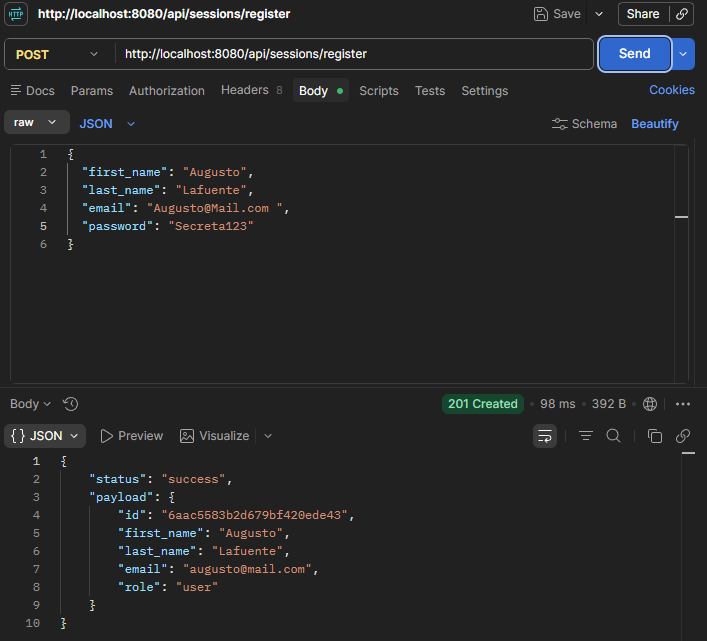
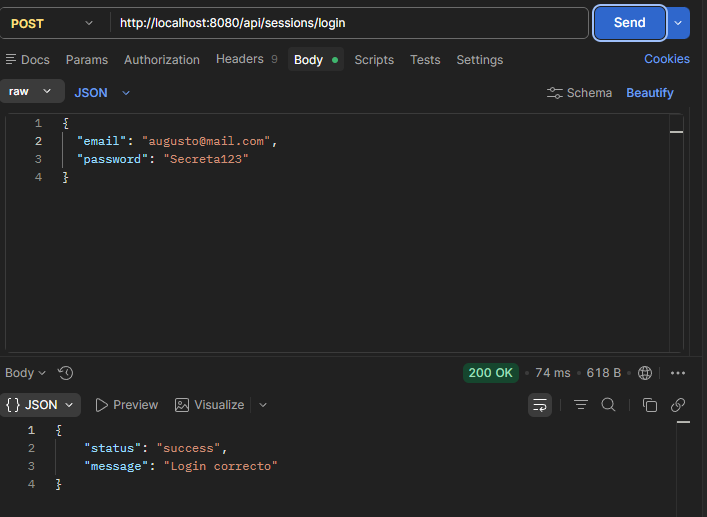
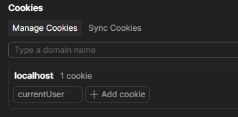
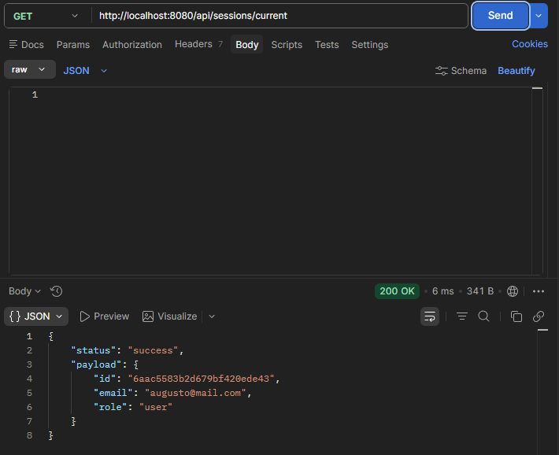
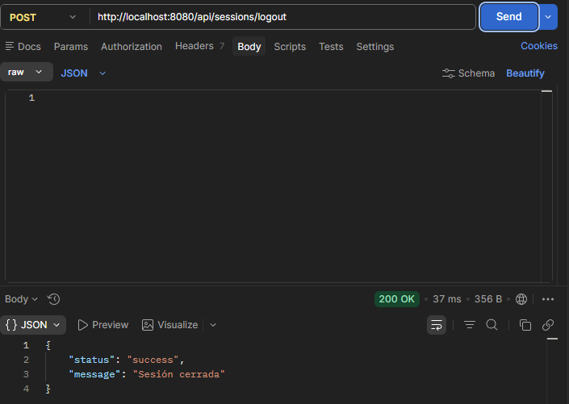

# 🏆 Plataforma de Gestión e Inscripción de Eventos Deportivos

## 📌 Descripción y Temática Elegida
Este proyecto consiste en el backend y base arquitectónica para una **Plataforma de Organización e Inscripción de Eventos Deportivos** (torneos de fútbol, carreras, maratones, torneos de tenis, básquetbol, ciclismo, etc.).

La plataforma está pensada para conectar a:
- **Organizadores de eventos**: Creación, administración, fijación de cupos, categorías y sedes deportivas.
- **Atletas / Participantes**: Búsqueda de eventos según disciplina deportiva, inscripción, reserva de plazas y seguimiento.
- **Administradores**: Control general, moderación de eventos y gestión de usuarios.

Esta primera entrega sienta las bases con un diseño limpio, desacoplado y preparado para escalar con arquitectura por capas (N-Tier).

---

## 🛠️ Tecnologías Utilizadas
- **Node.js**: Entorno de ejecución para JavaScript del lado del servidor.
- **Express.js**: Framework minimalista para crear APIs REST.
- **MongoDB / Mongoose**: Base de datos y ODM para la persistencia de datos.
- **bcrypt**: Hasheo seguro de contraseñas.
- **jsonwebtoken**: Generación y verificación de JWT para autenticación.
- **cookie-parser**: Lectura de cookies HTTP en las requests entrantes.
- **ES Modules (ESM)**: Sistema nativo de módulos con sintaxis `import` / `export`.
- **Dotenv**: Gestión de variables de entorno seguras.

---

## 📁 Estructura de Carpetas

```text
proyecto-eventos/
├── src/
│   ├── app.js                # Configuración de Express, middlewares y rutas principales
│   ├── server.js             # Inicialización y levantamiento del servidor HTTP
│   ├── config/               # Configuración de variables de entorno y constantes
│   │   └── config.js
│   ├── routes/               # Definición de rutas y endpoints de la API
│   │   ├── events.router.js  # Rutas de eventos deportivos
│   │   └── sessions.router.js# Rutas de autenticación y sesiones
│   ├── controllers/          # Controladores que reciben las peticiones y orquestan la respuesta
│   │   ├── events.controller.js
│   │   └── sessions.controller.js
│   ├── services/             # Lógica de negocio de la aplicación
│   │   └── sessions.service.js
│   ├── repositories/         # Capa intermedia de acceso a datos y mapeo
│   │   └── users.repository.js
│   ├── dao/                  # Data Access Object (acceso directo a Mongoose)
│   │   └── users.dao.js
│   ├── models/               # Modelos y esquemas (Mongoose) de entidades del dominio
│   │   ├── User.js           # Usuario (first_name, last_name, email, password, role)
│   │   └── Event.js          # Evento deportivo (disciplina, cupos, categoría, etc.)
│   ├── middlewares/          # Middlewares de validación, autenticación y manejo de errores
│   │   └── auth.middleware.js# Verifica el JWT de la cookie y protege rutas
│   └── utils/                # Utilidades, funciones auxiliares y helpers
│       ├── hash.js           # Helper de bcrypt (hash y comparación de contraseñas)
│       └── jwt.js            # Helper para firmar y verificar JWT
├── .env                      # Variables de entorno locales (ignorado en Git)
├── .env.example              # Plantilla de variables de entorno requeridas
├── .gitignore                # Reglas para excluir archivos sensibles y dependencias
├── package.json              # Configuración y dependencias del proyecto
└── README.md                 # Documentación del proyecto
```

---

## ⚙️ Configuración de Variables de Entorno

El proyecto utiliza variables de entorno para manejar la configuración de puertos, conexiones y secretos de forma segura:

- **`.env.example`**: Archivo público que sirve como **plantilla** documentando qué variables requiere la aplicación. Contiene únicamente valores ficticios o genéricos y **nunca** debe contener contraseñas, URLs privadas con credenciales ni claves reales.
- **`.env`**: Archivo local privado donde se definen los valores y credenciales reales para tu entorno de desarrollo o producción. Este archivo está incluido en `.gitignore` y **nunca** debe subirse al repositorio.

### Paso a paso para configurar tu entorno local:

1. **Crear el archivo `.env` a partir de la plantilla:**
   ```bash
   cp .env.example .env
   ```
   *(En Windows PowerShell: `Copy-Item .env.example .env` o crear el archivo manualmente).*

2. **Completar las variables en tu `.env` local:**

| Variable | Descripción | Ejemplo / Formato |
| :--- | :--- | :--- |
| `PORT` | Puerto donde correrá el servidor HTTP | `8080` |
| `NODE_ENV` | Entorno de ejecución (`development` / `production`) | `development` |
| `MONGO_URL` | URI de conexión a la base de datos MongoDB (local o Atlas) | `mongodb://localhost:27017/nombre_de_tu_db` |
| `JWT_SECRET` | Clave secreta para la firma y verificación de tokens JWT | `cadena_secreta_personalizada` |
| `JWT_EXPIRES_IN` | Tiempo de expiración del JWT (formato aceptado por `jsonwebtoken`) | `1h` |

---

## 🚀 Instalación y Ejecución

### 1. Clonar el repositorio e instalar dependencias
```bash
git clone <URL_DEL_REPOSITORIO>
cd <CARPETA_DEL_PROYECTO>
npm install
```

### 2. Iniciar el servidor

- **Modo producción / estándar:**
  ```bash
  npm start
  ```

- **Modo desarrollo (watch mode):**
  ```bash
  npm run dev
  ```

---

## 📍 Rutas y Endpoints Disponibles

### 🩺 Health Check
- **`GET /api/health`**
  - **Descripción**: Comprueba el estado de la API y si el servidor está respondiendo adecuadamente.
  - **Respuesta `200 OK`**:
    ```json
    {
      "status": "ok",
      "message": "Servidor activo"
    }
    ```

### ⚽ Eventos Deportivos
- **`GET /api/events`**
  - **Descripción**: Obtiene el listado de eventos deportivos disponibles (carreras, torneos, partidos, etc. - inicialmente vacío).
  - **Respuesta `200 OK`**:
    ```json
    {
      "status": "success",
      "payload": []
    }
    ```

### 🔐 Sesiones

- **`POST /api/sessions/register`**
  - **Descripción**: Registra un nuevo usuario en la plataforma. Valida los datos recibidos, normaliza el email, rechaza emails duplicados y hashea la contraseña con bcrypt antes de guardarla en MongoDB. El rol **no** puede ser definido desde el body: siempre se crea con el valor por defecto `user`.
  - **Body esperado**:
    | Campo | Tipo | Obligatorio | Reglas |
    | :--- | :--- | :--- | :--- |
    | `first_name` | string | Sí | No vacío |
    | `last_name` | string | Sí | No vacío |
    | `email` | string | Sí | Formato de email válido. Se normaliza con `trim` + `lowercase` |
    | `password` | string | Sí | Mínimo 8 caracteres |

  - **Request de ejemplo**:
    ```json
    {
      "first_name": "Ana",
      "last_name": "Pérez",
      "email": "Ana@Mail.com ",
      "password": "Secreta123"
    }
    ```

  - **Respuesta `201 Created`** (email normalizado, sin `password`):
    ```json
    {
      "status": "success",
      "payload": {
        "id": "665f2a...",
        "first_name": "Ana",
        "last_name": "Pérez",
        "email": "ana@mail.com",
        "role": "user"
      }
    }
    ```

  - **Respuesta `400 Bad Request`** (campos faltantes, email inválido o password muy corta):
    ```json
    { "status": "error", "message": "Faltan campos obligatorios" }
    ```

  - **Respuesta `409 Conflict`** (email ya registrado):
    ```json
    { "status": "error", "message": "El email ya está registrado" }
    ```

  - **Cómo probarlo con curl**:
    ```bash
    curl -X POST http://localhost:8080/api/sessions/register \
      -H "Content-Type: application/json" \
      -d '{"first_name":"Ana","last_name":"Pérez","email":"Ana@Mail.com","password":"Secreta123"}'
    ```

  - **Verificación de seguridad**: al consultar la colección `users` en MongoDB, el campo `password` debe verse como un hash de bcrypt (por ejemplo `$2b$10$...`), nunca en texto plano. La respuesta del endpoint nunca incluye el campo `password`.

- **`POST /api/sessions/login`**
  - **Descripción**: Valida `email` y `password`, busca el usuario y compara la contraseña con el hash guardado usando bcrypt. Si las credenciales son correctas, genera un JWT firmado (`JWT_SECRET`, expiración `JWT_EXPIRES_IN`) con el payload `{ id, email, role }` y lo guarda en una cookie `currentUser` (`httpOnly: true`, `sameSite: 'lax'`, `maxAge: 3600000`, `secure: true` solo en producción). Ante cualquier fallo (email inexistente o password incorrecta) responde siempre el mismo mensaje genérico, sin indicar cuál fue el problema.
  - **Body esperado**:
    | Campo | Tipo | Obligatorio |
    | :--- | :--- | :--- |
    | `email` | string | Sí |
    | `password` | string | Sí |

  - **Request de ejemplo**:
    ```json
    { "email": "ana@mail.com", "password": "Secreta123" }
    ```

  - **Respuesta `200 OK`** (además setea la cookie `currentUser` HttpOnly):
    ```json
    { "status": "success", "message": "Login correcto" }
    ```

  - **Respuesta `401 Unauthorized`** (email inexistente, password incorrecta o campos faltantes — mensaje genérico):
    ```json
    { "status": "error", "message": "Credenciales inválidas" }
    ```

  - **Cómo probarlo con curl** (guardando la cookie en `cookies.txt`):
    ```bash
    curl -i -X POST http://localhost:8080/api/sessions/login \
      -H "Content-Type: application/json" \
      -c cookies.txt \
      -d '{"email":"ana@mail.com","password":"Secreta123"}'
    ```

- **`GET /api/sessions/current`** 🔒 *(ruta protegida)*
  - **Descripción**: Requiere la cookie `currentUser`. El middleware `auth` lee la cookie, verifica el JWT y adjunta el payload decodificado a `req.user`. Devuelve los datos básicos del usuario autenticado, sin exponer `password`.
  - **Respuesta `200 OK`**:
    ```json
    {
      "status": "success",
      "payload": { "id": "665f2a...", "email": "ana@mail.com", "role": "user" }
    }
    ```

  - **Respuesta `401 Unauthorized`** (sin cookie, o token inválido/expirado/manipulado):
    ```json
    { "status": "error", "message": "No autenticado" }
    ```

  - **Cómo probarlo con curl** (reutilizando la cookie guardada en el login):
    ```bash
    curl -i http://localhost:8080/api/sessions/current -b cookies.txt
    ```

- **`POST /api/sessions/logout`**
  - **Descripción**: Elimina la cookie `currentUser`, cerrando la sesión del usuario.
  - **Respuesta `200 OK`**:
    ```json
    { "status": "success", "message": "Sesión cerrada" }
    ```

  - **Cómo probarlo con curl**:
    ```bash
    curl -i -X POST http://localhost:8080/api/sessions/logout -b cookies.txt -c cookies.txt
    ```

  - Tras el logout, un nuevo `GET /api/sessions/current` con la misma cookie debe responder `401`.

### 📋 Resumen de rutas

| Método | Ruta | Descripción | Protegida |
| :--- | :--- | :--- | :--- |
| `GET` | `/api/health` | Estado de la API | No |
| `GET` | `/api/events` | Listado de eventos deportivos | No |
| `POST` | `/api/sessions/register` | Registro de usuario | No |
| `POST` | `/api/sessions/login` | Login y emisión de cookie JWT | No |
| `GET` | `/api/sessions/current` | Usuario autenticado actual | Sí (cookie `currentUser`) |
| `POST` | `/api/sessions/logout` | Cierre de sesión (borra la cookie) | No |

---

## 📸 Evidencia de Pruebas (Postman)

A continuación se adjuntan las capturas de pantalla de las pruebas realizadas sobre el flujo de autenticación completo:

### 1. Registro Exitoso (`POST /api/sessions/register` - 201 Created)


### 2. Login Correcto (`POST /api/sessions/login` - 200 OK)


### 3. Cookie `currentUser` generada (HttpOnly, SameSite Lax)


### 4. Consulta de Usuario Autenticado (`GET /api/sessions/current` - 200 OK)


### 5. Cierre de Sesión (`POST /api/sessions/logout` - 200 OK)


